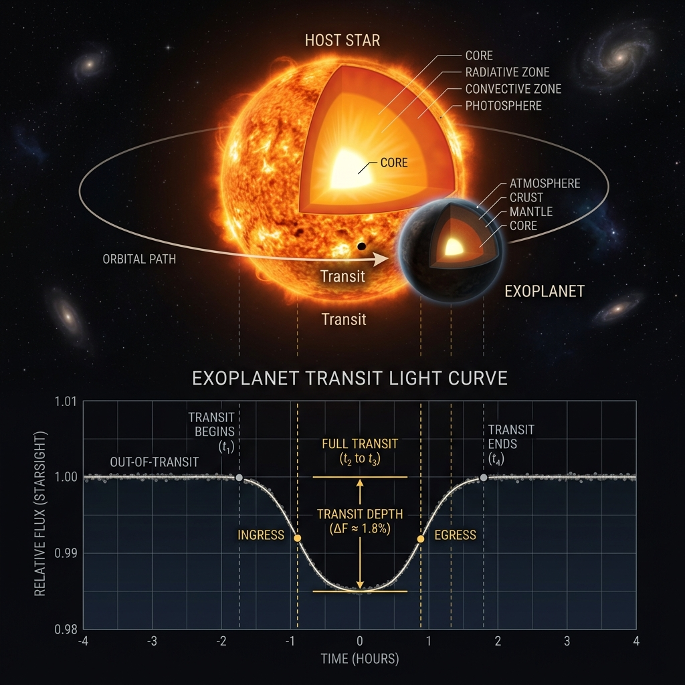
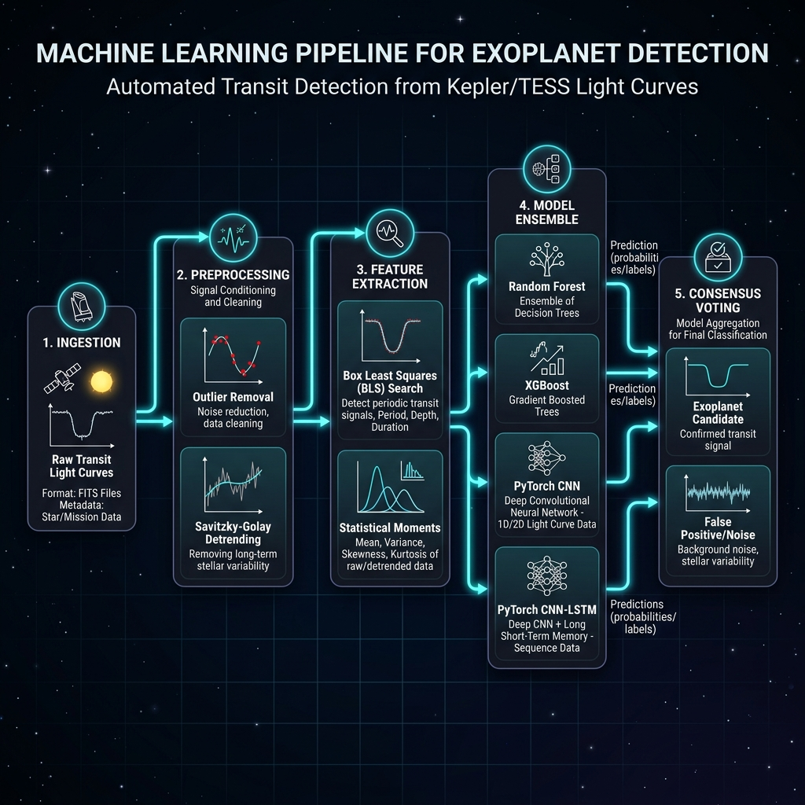

# AstroPulse: Scientific Foundations and Pipeline Architecture

This document provides a publication-grade review of the physics, mathematics, and machine learning architectures underlying the **AstroPulse Exoplanet Detection Pipeline**.

---

## 1. Astrophysical Principles of Transit Photometry

The primary method used by AstroPulse to detect exoplanets is **transit photometry**. When an exoplanet's orbital plane is aligned with our line of sight, it periodically crosses (transits) the disk of its host star, blocking a fraction of the stellar light.

### 1.1 Transit Depth ($\delta$)
The fraction of light blocked by the planet is directly proportional to the ratio of the cross-sectional area of the planet ($A_p$) to the star ($A_*$):

$$\delta = \frac{\Delta F}{F_0} \approx \left(\frac{R_p}{R_*}\right)^2$$

Where:
- $R_p$ is the planet's radius.
- $R_*$ is the star's radius.
- $F_0$ is the out-of-transit flux, and $\Delta F$ is the flux drop.

For a Jupiter-sized planet transiting a Sun-like star, $\delta \approx 1\%$. For an Earth-sized planet transiting a Sun-like star, $\delta \approx 0.01\%$ ($100\text{ ppm}$), requiring high-precision instruments like TESS or Kepler and advanced noise filtering.

### 1.2 Keplerian Orbital Dynamics
The semi-major axis $a$ (orbital distance) of the exoplanet is calculated using **Kepler's Third Law**:

$$P^2 = \frac{4\pi^2}{G(M_* + M_p)} a^3 \approx \frac{4\pi^2}{G M_*} a^3$$

Where:
- $P$ is the orbital period.
- $M_*$ is the host star mass ($M_* \gg M_p$).
- $G$ is the gravitational constant.

In astronomical units (AU) and solar parameters, this simplifies to:

$$a = \left(M_* \cdot P_{\text{yr}}^2\right)^{1/3}\text{ AU}$$

### 1.3 Transit Duration ($t_d$)
The duration of the transit $t_d$ is the time it takes the planet to cross the stellar disk. For a circular orbit, it is given by:

$$t_d \approx \frac{P}{\pi} \left(\frac{R_* \cdot \cos i}{a}\right) \sqrt{1 - b^2}$$

Where:
- $i$ is the orbital inclination.
- $b$ is the **impact parameter**, defined as the projected perpendicular distance from the planet's path to the center of the stellar disk at mid-transit (in units of stellar radii):

$$b = \frac{a \cos i}{R_*}$$

If $b \ge 1 + \frac{R_p}{R_*}$, no transit occurs. As $b$ approaches $1$, the chord length decreases, causing the transit duration to shrink and the transit shape to shift from a flat-bottomed **U-shape** to a grazing **V-shape**.

### 1.4 Stellar Limb Darkening
Stars are not uniform disks. Because we observe hotter, deeper layers of the stellar atmosphere at the center of the disk than at the edges (limbs), the star appears dimmer near the boundaries. This effect, called **limb darkening**, turns the idealized flat bottom of a transit light curve into a curved, bowl-like shape. We model this using a quadratic limb darkening law for the intensity $I(\mu)$:

$$\frac{I(\mu)}{I(1)} = 1 - u_1(1 - \mu) - u_2(1 - \mu)^2$$

Where:
- $\mu = \cos \theta = \sqrt{1 - r^2}$ (projected distance $r$ from the disk center).
- $u_1, u_2$ are the quadratic limb darkening coefficients depending on the star's temperature.

---

## 2. Signal Preprocessing and Detrending

Astronomical observations are corrupted by stellar variability (starspots, rotation, pulsations) and instrumental noise. The AstroPulse preprocessing pipeline cleans these signals in two primary steps:

1. **Outlier Mitigation**: Applies a sliding $3\sigma$-clipping threshold to eliminate cosmic ray strikes and sensor anomalies.
2. **Savitzky-Golay Filtering**: A local polynomial filter that fits a low-degree polynomial inside a sliding window:

   $$Y_j = \sum_{i=-m}^{m} C_i \cdot X_{j+i}$$

   This removes high-amplitude, low-frequency stellar rotations (e.g. starspots) without distorting the sharp, high-frequency boundaries (ingress/egress) of the transit signal.

---

## 3. The AstroPulse Machine Learning Pipeline

AstroPulse deploys a hybrid architecture combining statistical tabular classifiers with deep temporal neural networks to achieve state-of-the-art vetting completeness.

### 3.1 Feature Engineering
From the cleaned time-series data, we extract:
1. **Statistical Moments**: Standard deviation, skewness ($g_1$), and excess kurtosis ($g_2$) of the raw and detrended flux to capture noise and stellar flares.
2. **BLS Periodogram Parameters**: Running the Box Least Squares (BLS) algorithm yields the best period ($P$), transit depth ($\delta$), epoch ($t_0$), duration, and signal-to-noise ratio ($SNR$).
3. **Odd-Even Depth Consistency**: Calculates the difference in transit depth between odd and even transits:
   $$R_{\text{oe}} = \frac{|\delta_{\text{odd}} - \delta_{\text{even}}|}{\sqrt{\sigma^2_{\text{odd}} + \sigma^2_{\text{even}}}}$$
   Eclipsing binaries often consist of two different stars, creating alternating shallow and deep secondary eclipses. A high $R_{\text{oe}}$ indicates an eclipsing binary false positive.
4. **Folded Phase Vector**: The light curve is phase-folded using the best period $P$:
   $$\phi = \frac{t - t_0}{P} \pmod 1 - 0.5$$
   The folded data is placed in 200 uniform phase bins to serve as the input for our Deep Learning models.

### 3.2 Ensemble Model Architectures
AstroPulse averages the predictions of five diverse classifiers to yield the final exoplanet consensus:

1. **Random Forest (Tabular)**: Combines 100 decision trees to rank feature importances and establish baseline vetting splits.
2. **XGBoost (Tabular)**: A gradient-boosted tree framework that minimizes a regularized objective function, excelling at separating V-shaped binary eclipses.
3. **LightGBM (Tabular)**: A fast, leaf-wise gradient boosting model designed for high-speed vetting of large target lists.
4. **PyTorch 1D CNN (Deep Learning)**: Convolves a 1D filter across the 200-bin folded profile, acting as a spatial shape match filter:
   $$x_i^{(l)} = f \left( \sum_{j} w_j \cdot x_{i+j}^{(l-1)} + b \right)$$
5. **PyTorch CNN-LSTM Hybrid (Deep Learning)**: Feeds the feature maps of a 1D CNN into a Long Short-Term Memory (LSTM) layer, modeling the sequential correlation of the ingress and egress phases.

---

## 4. Verification and Monte Carlo Confidence Estimation

To estimate the reliability of a detected transit, the pipeline runs a **Monte Carlo (MC) simulator**:
1. It adds Gaussian perturbations to the light curve corresponding to the calculated stellar noise level.
2. Re-fits the transit parameters using BLS.
3. Computes the standard deviation of the period, depth, and duration across 25 trials.
4. Calculates a **Consensus Confidence Score** based on the ensemble model consensus combined with transit SNR and fit stability:

   $$\text{Confidence} = 0.5 \cdot \text{Ensemble\_Prob} + 0.3 \cdot \text{SNR\_Factor} + 0.2 \cdot \text{Fit\_Stability}$$

A confidence score $> 75\%$ is classified as a **Confirmed Planet Candidate**, while lower scores trigger automatic alerts for secondary visual inspections.
